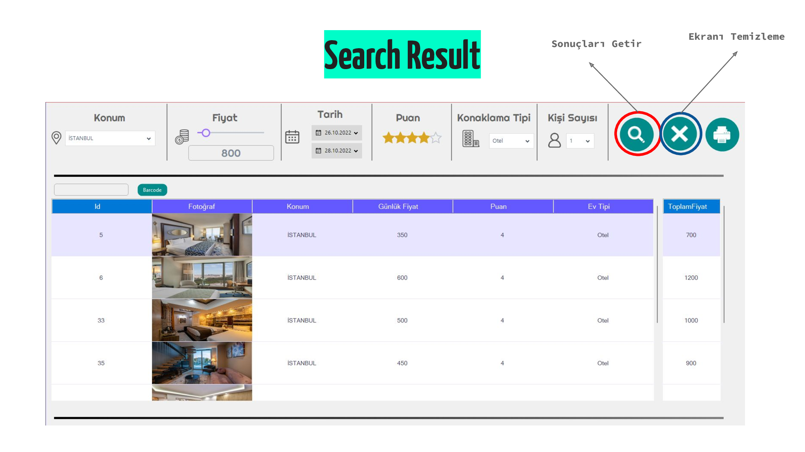
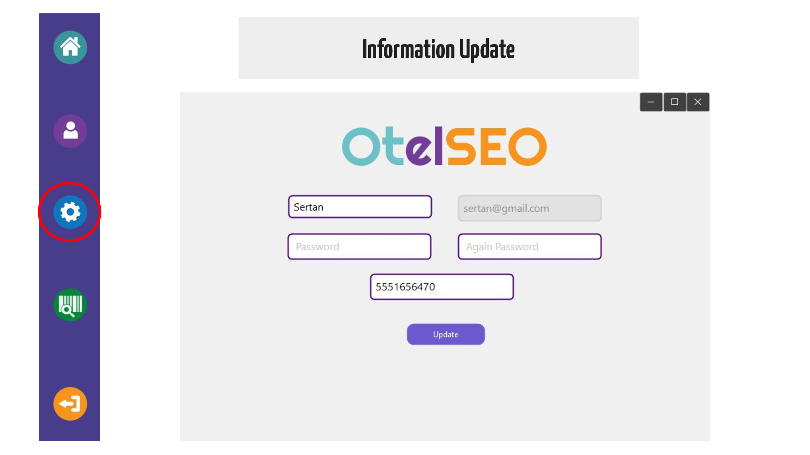
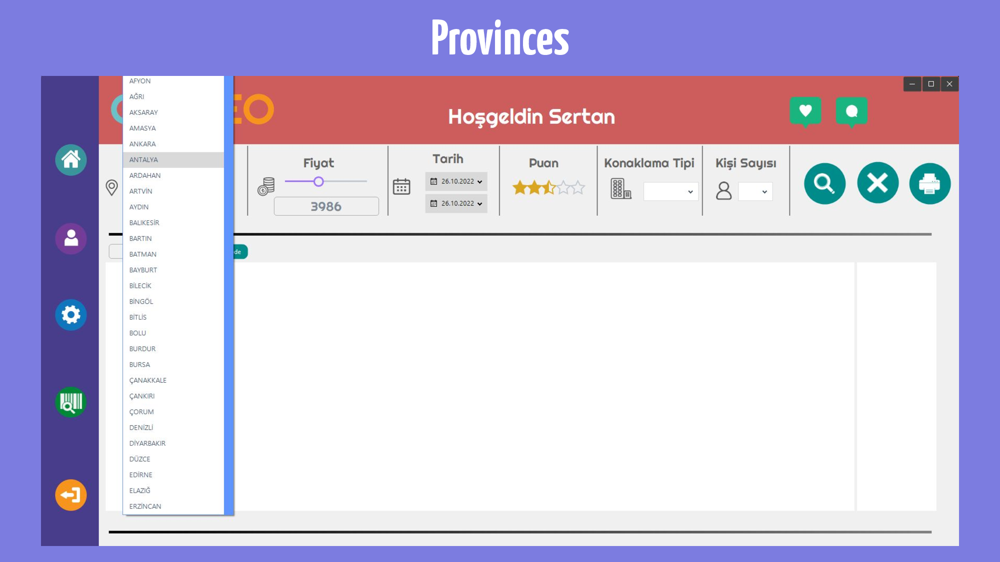

# C--Hotel-Search-Project

-First of all, you must enter the folder named FingerMobile and install the Fingerprint Application on your Phone with Phone Connection.

-After downloading, you will have your fingerprint read after you write your own Phone IP Address in the Space field and send it here. Phone and Computer Wifi must be connected to the same internet.

-After you register, you can find the hotel you want in the most convenient way.

-You have to click on it and click on the Printer Button and download the PDF.

